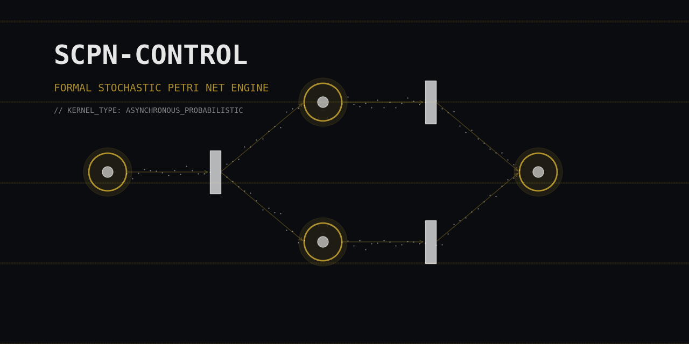
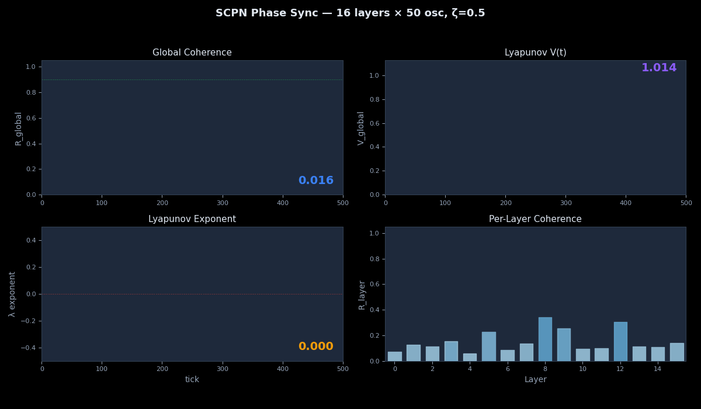

<p align="center">
  
</p>

<p align="center">
  <a href="https://github.com/anulum/scpn-control/actions"></a>
  <a href="https://github.com/anulum/scpn-control/actions/workflows/docs-pages.yml"></a>
  <a href="https://pypi.org/project/scpn-control/"></a>
  <a href="https://pypi.org/project/scpn-control/"></a>
  <a href="https://scpn-control.streamlit.app"></a>
  <a href="LICENSE"></a>
  <a href="https://www.bestpractices.dev/projects/12176"></a>
  <a href="https://orcid.org/0009-0009-3560-0851"></a>
  <a href="https://arxiv.org/abs/2004.06344"></a>
  <a href="docs/REVIEWER_PAPER27_INTEGRATION.pdf"></a>
  <a href="https://codecov.io/gh/anulum/scpn-control"></a>
  <a href="https://doi.org/10.5281/zenodo.18804939"></a>
  <a href="https://buy.stripe.com/4gM00kbiMdjAberaYz5J601"></a>
</p>

---

**scpn-control** is a standalone neuro-symbolic control engine that compiles
Stochastic Petri Nets into spiking neural network controllers with
contract-based pre/post-condition checking. Extracted from
[scpn-fusion-core](https://github.com/anulum/scpn-fusion-core) — 78 source
modules, 220+ test files, **3,015 tests** (100% coverage), 5 Rust crates, 20 CI jobs.

> **11.9 µs P50 kernel step** (Criterion-verified, GitHub Actions ubuntu-latest).
> This is a bare Rust kernel call, not a complete control cycle.
> See [competitive analysis](docs/competitive_analysis.md) for full benchmarks
> and [Limitations](#limitations) for honest scope.
>
> **Status: Alpha / Research.** Not a production PCS. No real tokamak
> deployment. Validated against synthetic data and published GEQDSK files only.

## Quick Start

```bash
pip install scpn-control                        # core (numpy, scipy, click)
pip install "scpn-control[dashboard,ws]"        # + Streamlit dashboard + WebSocket
scpn-control demo --steps 1000
scpn-control benchmark --n-bench 5000
```

For development (editable install):

```bash
git clone https://github.com/anulum/scpn-control.git
cd scpn-control
pip install -e ".[dev]"
```

### Python in 30 Seconds

```python
from scpn_control.core.jax_gs_solver import jax_gs_solve
psi = jax_gs_solve(NR=33, NZ=33, Ip_target=1e6, n_picard=40, n_jacobi=100)

from scpn_control.scpn.structure import StochasticPetriNet
from scpn_control.scpn.compiler import FusionCompiler
net = StochasticPetriNet()
net.add_place("idle", initial_tokens=1.0)
net.add_place("heating"); net.add_transition("ignite")
net.add_arc("idle", "ignite"); net.add_arc("ignite", "heating")
net.compile()
artifact = FusionCompiler().compile(net)  # SPN -> SNN
```

Full walkthrough: `python examples/quickstart.py`

## Documentation and Tutorials

- Documentation site: https://anulum.github.io/scpn-control/
- Local docs index: `docs/index.md`
- Benchmark guide: `docs/benchmarks.md`
- Notebook tutorials:
  - `examples/neuro_symbolic_control_demo.ipynb`
  - `examples/q10_breakeven_demo.ipynb`
  - `examples/snn_compiler_walkthrough.ipynb`
  - `examples/paper27_phase_dynamics_demo.ipynb` — Knm/UPDE + ζ sin(Ψ−θ)
  - `examples/snn_pac_closed_loop_demo.ipynb` — SNN-PAC-Kuramoto closed loop
  - `examples/streamlit_ws_client.py` — live WebSocket phase sync dashboard

Build docs locally:

```bash
python -m pip install mkdocs
mkdocs serve
```

Execute all notebooks:

```bash
python -m pip install "scpn-control[viz]" jupyter nbconvert
jupyter nbconvert --to notebook --execute --output-dir artifacts/notebook-exec examples/q10_breakeven_demo.ipynb
jupyter nbconvert --to notebook --execute --output-dir artifacts/notebook-exec examples/snn_compiler_walkthrough.ipynb
```

Optional notebook (requires `sc_neurocore` available in environment):

```bash
jupyter nbconvert --to notebook --execute --output-dir artifacts/notebook-exec examples/neuro_symbolic_control_demo.ipynb
```

## Features

- **Petri Net to SNN compilation** -- Translates Stochastic Petri Nets into spiking neural network controllers with LIF neurons and bitstream encoding
- **Contract checking** -- Runtime pre/post-condition assertions on control observations and actions (not theorem-proved formal verification)
- **Sub-millisecond latency** -- <1ms control loop with optional Rust-accelerated kernels
- **Rust acceleration** -- PyO3 bindings for SCPN activation, marking update, Boris integration, SNN pools, and MPC
- **10 controller types** -- PID, MPC, NMPC, H-infinity, mu-synthesis, gain-scheduled, sliding-mode, fault-tolerant, SNN, PPO reinforcement learning
- **Grad-Shafranov solver** -- Fixed + free-boundary equilibrium solver with L/H-mode profiles, JAX-differentiable (`jax.grad` through full Picard solve)
- **Frontier physics** -- Gyrokinetic transport (TGLF-10), ballooning eigenvalue solver, sawtooth Kadomtsev model, NTM dynamics, current diffusion/drive, SOL two-point model
- **MHD stability** -- Five independent criteria: Mercier interchange, ballooning, Kruskal-Shafranov kink, Troyon beta limit, NTM seeding
- **JAX autodiff** -- Thomas solver, Crank-Nicolson transport, neural equilibrium, GS solver — all JIT-compiled and GPU-compatible
- **PPO agent** -- 500K-step cloud-trained RL controller (reward 143.7 vs MPC 58.1 vs PID −912.3), 3-seed reproducible
- **Neural transport** -- QLKNN-10D trained MLP with auto-discovered weights
- **Scenario management** -- Integrated scenario simulator (transport + current diffusion + sawteeth + NTM + SOL), scenario scheduler, ITER/NSTX-U presets
- **Digital twin integration** -- Real-time telemetry ingest, closed-loop simulation, real-time EFIT, and flight simulator
- **RMSE validation** -- CI-gated regression testing against synthetic DIII-D shots and published SPARC GEQDSK files
- **Disruption prediction** -- ML-based predictor with SPI mitigation and halo/RE physics
- **Robust control** -- H-infinity DARE synthesis, mu-synthesis D-K iteration, fault-tolerant degraded-mode operation, shape controller with boundary Jacobian

## Architecture

```
src/scpn_control/
+-- scpn/              # Petri net -> SNN compiler
|   +-- structure.py   #   StochasticPetriNet graph builder
|   +-- compiler.py    #   FusionCompiler -> CompiledNet (LIF + bitstream)
|   +-- contracts.py   #   ControlObservation, ControlAction, ControlTargets
|   +-- controller.py  #   NeuroSymbolicController (main entry point)
+-- core/              # Physics solvers + plant models (29 modules)
|   +-- fusion_kernel.py           # Grad-Shafranov equilibrium (fixed + free boundary)
|   +-- integrated_transport_solver.py  # Multi-species transport PDE
|   +-- gyrokinetic_transport.py   # Quasilinear TGLF-10 (ITG/TEM/ETG)
|   +-- ballooning_solver.py       # s-alpha ballooning eigenvalue ODE
|   +-- sawtooth.py                # Kadomtsev crash + Porcelli trigger
|   +-- ntm_dynamics.py            # Modified Rutherford NTM + ECCD stabilization
|   +-- current_diffusion.py       # Parallel current evolution PDE
|   +-- current_drive.py           # ECCD, NBI, LHCD deposition models
|   +-- sol_model.py               # Two-point SOL + Eich heat-flux width
|   +-- rzip_model.py              # Linearised vertical stability (RZIp)
|   +-- integrated_scenario.py     # Full scenario simulator (ITER/NSTX-U presets)
|   +-- stability_mhd.py           # 5 MHD stability criteria
|   +-- scaling_laws.py            # IPB98y2 confinement scaling
|   +-- neural_transport.py        # QLKNN-10D trained surrogate
|   +-- neural_equilibrium.py      # PCA+MLP GS surrogate (1000x speedup)
|   +-- ...                        # 14 more (eqdsk, uncertainty, pedestal, ...)
+-- control/           # Controllers (37 modules, optional deps guarded)
|   +-- h_infinity_controller.py   # H-inf robust control (DARE)
|   +-- mu_synthesis.py            # D-K iteration (structured singular value)
|   +-- nmpc_controller.py         # Nonlinear MPC (SQP, 20-step horizon)
|   +-- gain_scheduled_controller.py  # PID scheduled on operating regime
|   +-- sliding_mode_vertical.py   # Sliding-mode vertical stabilizer
|   +-- fault_tolerant_control.py  # Fault detection + degraded-mode operation
|   +-- shape_controller.py        # Plasma shape via boundary Jacobian
|   +-- safe_rl_controller.py      # PPO + MHD constraint checker
|   +-- scenario_scheduler.py      # Shot timeline + actuator scheduling
|   +-- realtime_efit.py           # Streaming equilibrium reconstruction
|   +-- control_benchmark_suite.py # Standardised benchmark scenarios
|   +-- disruption_predictor.py    # ML disruption prediction + SPI
|   +-- tokamak_digital_twin.py    # Digital twin
|   +-- ...                        # 24 more (MPC, flight sim, HIL, ...)
+-- phase/             # Paper 27 Knm/UPDE phase dynamics (8 modules)
|   +-- kuramoto.py    #   Kuramoto-Sakaguchi step + order parameter
|   +-- knm.py         #   Paper 27 Knm coupling matrix builder
|   +-- upde.py        #   UPDE multi-layer solver
|   +-- lyapunov_guard.py          # Sliding-window stability monitor
|   +-- realtime_monitor.py        # Tick-by-tick UPDE + TrajectoryRecorder
|   +-- ws_phase_stream.py         # Async WebSocket live stream server
+-- cli.py             # Click CLI

scpn-control-rs/       # Rust workspace (5 crates)
+-- control-types/     # PlasmaState, EquilibriumConfig, ControlAction
+-- control-math/      # LIF neuron, Boris pusher, Kuramoto, upde_tick
+-- control-core/      # GS solver, transport, confinement scaling
+-- control-control/   # PID, MPC, H-inf, SNN controller
+-- control-python/    # PyO3 bindings (PyRealtimeMonitor, PySnnPool, ...)

tests/                 # 2,786 tests (178 files, 100% coverage)
+-- mock_diiid.py      # Synthetic DIII-D shot generator (NOT real MDSplus data)
+-- test_e2e_phase_diiid.py  # E2E: shot-driven monitor + HDF5/NPZ export
+-- test_phase_kuramoto.py   # 50 Kuramoto/UPDE/Guard/Monitor tests
+-- test_rust_realtime_parity.py  # Rust PyRealtimeMonitor parity
+-- ...                # 170+ more test files
```

## Paper 27 Phase Dynamics (Knm/UPDE Engine)

Implements the generalized Kuramoto-Sakaguchi mean-field model with exogenous
global field driver `ζ sin(Ψ − θ)`, per arXiv:2004.06344 and SCPN Paper 27.

**Modules:** `src/scpn_control/phase/` (7 files)

| Module | Purpose |
|--------|---------|
| `kuramoto.py` | Kuramoto-Sakaguchi step, order parameter R·e^{iΨ}, Lyapunov V/λ |
| `knm.py` | Paper 27 16×16 coupling matrix (exponential decay + calibration anchors) |
| `upde.py` | UPDE multi-layer solver with PAC gating |
| `lyapunov_guard.py` | Sliding-window stability monitor (mirrors DIRECTOR_AI CoherenceScorer) |
| `realtime_monitor.py` | Tick-by-tick UPDE + TrajectoryRecorder (HDF5/NPZ export) |
| `ws_phase_stream.py` | Async WebSocket server streaming R/V/λ per tick |

**Rust acceleration:** `upde_tick()` in `control-math` + `PyRealtimeMonitor` PyO3 binding.

**Live phase sync convergence** ([GIF fallback](docs/phase_sync_live.gif)):

<p align="center">
  <video src="docs/phase_sync_live.mp4" autoplay loop muted playsinline width="100%">
    
  </video>
</p>

> 500 ticks, 16 layers × 50 oscillators, ζ=0.5. R converges to 0.92,
> V→0, λ settles to −0.47 (stable). Generated by `tools/generate_phase_video.py`.

**WebSocket live stream:**

```bash
# Terminal 1: start server (CLI)
scpn-control live --port 8765 --zeta 0.5

# Terminal 2: Streamlit WS client (live R/V/λ plots, guard status, control)
pip install "scpn-control[dashboard,ws]"
streamlit run examples/streamlit_ws_client.py

# Or embedded mode (server + client in one process)
streamlit run examples/streamlit_ws_client.py -- --embedded
```

**E2E test with mock DIII-D shot data:**

```bash
pytest tests/test_e2e_phase_diiid.py -v
```

## Dependencies

| Required | Optional |
|----------|----------|
| numpy >= 1.24 | sc-neurocore >= 3.8.0 (`pip install "scpn-control[neuro]"`) |
| scipy >= 1.10 | matplotlib (`pip install "scpn-control[viz]"`) |
| click >= 8.0 | streamlit (`pip install "scpn-control[dashboard]"`) |
| | torch (`pip install "scpn-control[ml]"`) |
| | nengo (`pip install "scpn-control[nengo]"`) |
| | h5py (`pip install "scpn-control[hdf5]"`) |
| | websockets (`pip install "scpn-control[ws]"`) |

## CLI

```bash
scpn-control demo --scenario combined --steps 1000   # Closed-loop control demo
scpn-control benchmark --n-bench 5000                 # PID vs SNN timing benchmark
scpn-control validate                                 # RMSE validation dashboard
scpn-control live --port 8765 --zeta 0.5              # Real-time WS phase sync server
scpn-control hil-test --shots-dir ...                 # HIL test campaign
```

## Benchmarks

Python micro-benchmark:

```bash
scpn-control benchmark --n-bench 5000 --json-out
```

Rust Criterion benchmarks:

```bash
cd scpn-control-rs
cargo bench --workspace
```

Benchmark docs: `docs/benchmarks.md`

## Dashboard

```bash
pip install "scpn-control[dashboard]"
streamlit run dashboard/control_dashboard.py
```

Six tabs: Trajectory Viewer, RMSE Dashboard, Timing Benchmark, Shot Replay,
Phase Sync Monitor (live R/V/λ plots), Benchmark Plots (interactive Vega).

### Streamlit Cloud

**Live dashboard:** [scpn-control.streamlit.app](https://scpn-control.streamlit.app)

The phase sync dashboard runs on Streamlit Cloud with embedded server mode
(no external WS server needed). Entry point: `streamlit_app.py`.

To deploy your own instance:
1. Fork to your GitHub
2. [share.streamlit.io](https://share.streamlit.io) > New app > select `streamlit_app.py`
3. Deploy (auto-starts embedded PhaseStreamServer)

## Rust Acceleration

```bash
cd scpn-control-rs
cargo test --workspace

# Build Python bindings
cd crates/control-python
pip install maturin
maturin develop --release
cd ../../

# Verify
python -c "import importlib.util; from scpn_control.core._rust_compat import _rust_available; print(bool(importlib.util.find_spec('scpn_control_rs') and _rust_available()))"
```

The Rust backend provides PyO3 bindings for:
- `PyFusionKernel` -- Grad-Shafranov solver
- `PySnnPool` / `PySnnController` -- Spiking neural network pools
- `PyMpcController` -- Model Predictive Control
- `PyPlasma2D` -- Digital twin
- `PyTransportSolver` -- Chang-Hinton + Sauter bootstrap
- `PyRealtimeMonitor` -- Multi-layer Kuramoto UPDE tick (phase dynamics)
- SCPN kernels -- `dense_activations`, `marking_update`, `sample_firing`

## Citation

```bibtex
@software{sotek2026scpncontrol,
  title   = {SCPN Control: Neuro-Symbolic Stochastic Petri Net Controller},
  author  = {Sotek, Miroslav and Reiprich, Michal},
  year    = {2026},
  url     = {https://github.com/anulum/scpn-control},
  license = {AGPL-3.0-or-later}
}
```

## Release and PyPI

**Local publish script:**

```bash
# Dry run (build + check, no upload)
python tools/publish.py --dry-run

# Publish to TestPyPI
python tools/publish.py --target testpypi

# Bump version + publish to PyPI
python tools/publish.py --bump minor --target pypi --confirm
```

**CI workflow** (tag-triggered trusted publishing):

```bash
git tag v0.2.0
git push --tags
# → .github/workflows/publish-pypi.yml runs automatically
```

## Limitations & Honest Scope

> These are not future roadmap items — they are current architectural
> constraints that users must understand.

- **No real tokamak data**: All "DIII-D shots" are synthetic (mock_diiid.py).
  No MDSplus, no experimental replay, no real-world validation.
- **No peer-reviewed fusion publication**: Paper 27 (arXiv:2004.06344) is
  unpublished in a fusion journal. No external citations.
- **Not a production PCS**: Alpha-stage research software. No ITER CODAC,
  no EPICS interface, no safety certification, no real hardware deployment.
- **"Formal verification" is contract checking**: Runtime pre/post-condition
  assertions, not theorem-proved guarantees (no Coq/Lean/TLA+).
- **Benchmark comparisons are not apples-to-apples**: The 11.9 µs number is a
  bare Rust kernel step. DIII-D PCS timings include I/O, diagnostics, and
  actuator commands. A fair comparison requires equivalent end-to-end
  measurement on comparable hardware.
- **Equilibrium solver**: Two variants exist: stable fixed-boundary GS, plus an
  experimental free-boundary external-coil scaffold. The free-boundary path is
  not yet sufficient for full shape control, X-point geometry, or divertor
  configuration. No stellarator geometry.
- **Transport**: 1.5D flux-surface-averaged. No turbulence micro-instability
  models (TGLF/QuaLiKiz) — uses Chang-Hinton neoclassical + scaling-law anomalous.
- **Disruption predictor**: Synthetic training data only. Not validated on
  experimental disruption databases.
- **No GPU equilibrium**: P-EFIT is faster on GPU hardware. JAX neural equilibrium
  runs on GPU if available but is not cross-validated against P-EFIT.
- **Rust acceleration**: Optional. Pure-Python fallback is complete but 5-10x
  slower for GS solve and Kuramoto steps at N > 1000.

## Support the Project

**scpn-control** is open-source (MIT / Apache-2.0). Funding goes to compute,
validation data, and development time.

| | | |
|---|---|---|
| [Sponsor via Stripe](https://buy.stripe.com/4gM00kbiMdjAberaYz5J601) | [Donate via PayPal](https://www.paypal.com/donate?hosted_button_id=4X5F6DNT934HY) | [Pay via TWINT](https://go.twint.ch/1/e/tw?tw=acq.lJTAypb8SL2s8vPg7fL0ubi2C220ajOH0BEQn1aKfEJIiIakLpt8jlEv8XdQ9tCp.) |

**Crypto:** BTC `bc1qg48gdmrjrjumn6fqltvt0cf0w6nvs0wggy37zd` ·
ETH `0xd9b07F617bEff4aC9CAdC2a13Dd631B1980905FF` ·
LTC `ltc1q886tmvtlnj86kmg2urd8f5td3lmfh32xtpdrut`

**Bank:** CHF IBAN CH14 8080 8002 1898 7544 1 · EUR IBAN CH66 8080 8002 8173 6061 8 · BIC RAIFCH22

Full tier details (Pro, Academic, Enterprise, Sponsorships): [docs/pricing.md](docs/pricing.md)

## Authors

- **Miroslav Sotek** — ANULUM CH & LI — [ORCID](https://orcid.org/0009-0009-3560-0851)
- **** — ANULUM CH & LI

## License

- Concepts: Copyright 1996-2026
- Code: Copyright 2024-2026
- License: AGPL-3.0-or-later

Dual-licensed under [MIT](LICENSE-MIT) or [Apache-2.0](LICENSE-APACHE), at your option.
