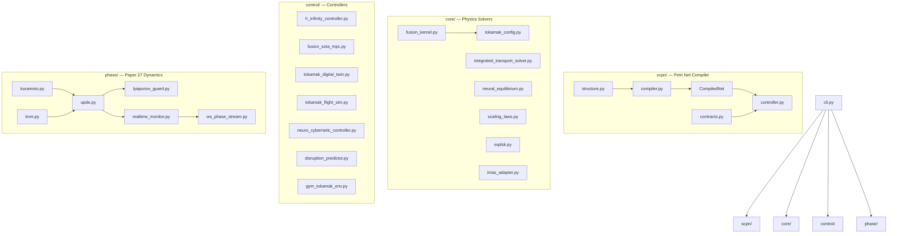
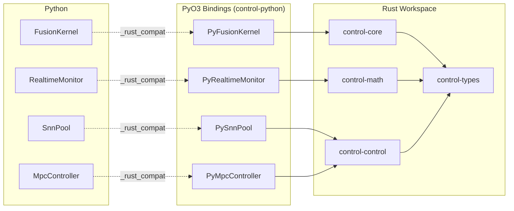
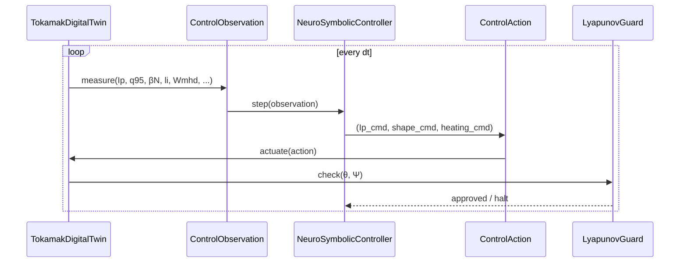

# Architecture

## Module Map



## Rust / Python Boundary



The `_rust_compat.py` module probes for the compiled `scpn_control_rs` extension
at import time. If present, hot paths (GS solve, Kuramoto step, SNN tick, MPC
solve) dispatch to Rust. Otherwise, pure-NumPy fallbacks execute identically.

## Data Flow: Closed-Loop Control



## Directory Layout

```
scpn-control/
├── src/scpn_control/     # 48 Python modules
│   ├── scpn/             # SPN → SNN compiler (5 modules)
│   ├── core/             # Equilibrium, transport, scaling (11 modules)
│   ├── control/          # Controllers (17 modules, optional deps guarded)
│   └── phase/            # Kuramoto/UPDE engine (7 modules)
├── scpn-control-rs/      # Rust workspace (5 crates)
├── tests/                # 701 tests (50 files)
├── examples/             # 6 notebooks + 3 scripts
├── validation/           # DIII-D, JET, SPARC, ITER configs + reference data
├── docs/                 # MkDocs site
└── tools/                # CI gates, calibration, publishing
```
