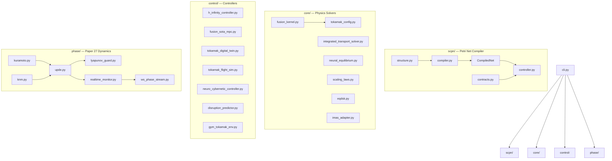
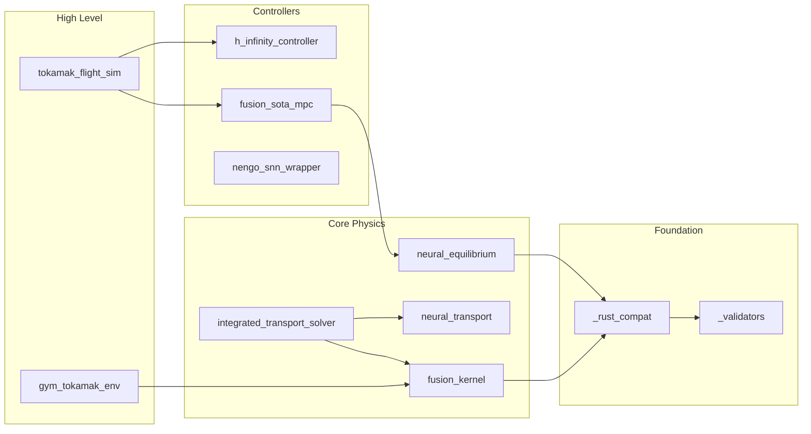
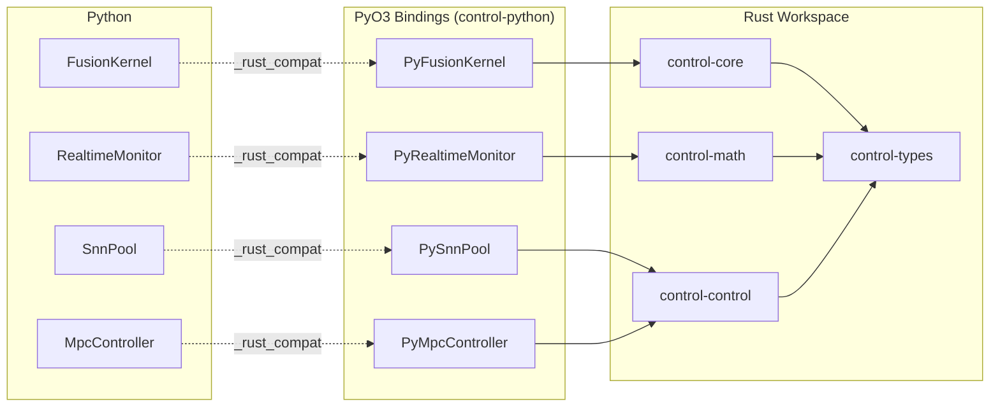
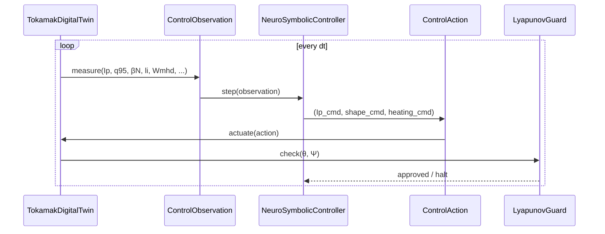

# Architecture

## Module Map


```mermaid
graph TD
    CLI[cli.py] --> SCPN[scpn/]
    CLI --> CORE[core/]
    CLI --> CTRL[control/]
    CLI --> PHASE[phase/]

    subgraph "scpn/ — Petri Net Compiler"
        SPN[structure.py] --> COMP[compiler.py]
        COMP --> CNET[CompiledNet]
        CNET --> NSC[controller.py]
        CON[contracts.py] --> NSC
    end

    subgraph "core/ — Physics Solvers"
        FK[fusion_kernel.py] --> TC[tokamak_config.py]
        ITS[integrated_transport_solver.py]
        NEQ[neural_equilibrium.py]
        SL[scaling_laws.py]
        EQ[eqdsk.py]
        IMAS[imas_adapter.py]
    end

    subgraph "control/ — Controllers"
        HINF[h_infinity_controller.py]
        MPC[fusion_sota_mpc.py]
        DT[tokamak_digital_twin.py]
        FS[tokamak_flight_sim.py]
        NCC[neuro_cybernetic_controller.py]
        DP[disruption_predictor.py]
        GYM[gym_tokamak_env.py]
    end

    subgraph "phase/ — Paper 27 Dynamics"
        KUR[kuramoto.py] --> UPDE[upde.py]
        KNM[knm.py] --> UPDE
        UPDE --> LG[lyapunov_guard.py]
        UPDE --> RM[realtime_monitor.py]
        RM --> WS[ws_phase_stream.py]
    end
```

## Logical Data Flow

The following diagram illustrates the signal path from equilibrium input to real-time
actuation through the optional Rust acceleration layer.

```text
GEQDSK/IMAS Input
    ↓
FusionKernel (GS solver, 65×65)
    ↓                    ↓
NeuralEquilibrium   IntegratedTransportSolver
(0.39ms surrogate)    (1.5D Crank-Nicolson)
    ↓                    ↓
    └──────┬─────────────┘
           ↓
    Controller Selection
    ├── PID (IsoFluxController)
    ├── H-infinity (HInfinityController)
    ├── MPC (ModelPredictiveController)
    ├── RL/PPO (GymTokamakEnv + SB3)
    └── SNN (NengoSNNController)
           ↓
    DisruptionPredictor
    (LSTM + Greenwald + VDE)
           ↓
    SPIMitigation → CoilSet actuation
           ↓
    Rust Kernel (11.9 µs, PyO3)
```

## Module Dependencies

Simplified internal dependency graph (arrows indicate "imports"):


```mermaid
graph LR
    subgraph "High Level"
        FS[tokamak_flight_sim]
        GYM[gym_tokamak_env]
    end

    subgraph "Controllers"
        MPC[fusion_sota_mpc]
        HINF[h_infinity_controller]
        SNN[nengo_snn_wrapper]
    end

    subgraph "Core Physics"
        ITS[integrated_transport_solver]
        FK[fusion_kernel]
        NEQ[neural_equilibrium]
        NT[neural_transport]
    end

    subgraph "Foundation"
        RC[_rust_compat]
        VAL[_validators]
    end

    FS --> MPC
    FS --> HINF
    GYM --> FK
    MPC --> NEQ
    ITS --> FK
    ITS --> NT
    FK --> RC
    NEQ --> RC
    RC --> VAL
```

## Rust / Python Boundary


```mermaid
flowchart LR
    subgraph Python
        P1[FusionKernel]
        P2[RealtimeMonitor]
        P3[SnnPool]
        P4[MpcController]
    end

    subgraph "PyO3 Bindings (control-python)"
        B1[PyFusionKernel]
        B2[PyRealtimeMonitor]
        B3[PySnnPool]
        B4[PyMpcController]
    end

    subgraph "Rust Workspace"
        R1[control-core]
        R2[control-math]
        R3[control-control]
        R4[control-types]
    end

    P1 -. "_rust_compat" .-> B1 --> R1
    P2 -. "_rust_compat" .-> B2 --> R2
    P3 -. "_rust_compat" .-> B3 --> R3
    P4 -. "_rust_compat" .-> B4 --> R3
    R1 --> R4
    R2 --> R4
    R3 --> R4
```

The `_rust_compat.py` module probes for the compiled `scpn_control_rs` extension
at import time. If present, hot paths (GS solve, Kuramoto step, SNN tick, MPC
solve) dispatch to Rust. Otherwise, pure-NumPy fallbacks execute identically.

## Data Flow: Closed-Loop Control


```mermaid
sequenceDiagram
    participant Plant as TokamakDigitalTwin
    participant Obs as ControlObservation
    participant Ctrl as NeuroSymbolicController
    participant Act as ControlAction
    participant Guard as LyapunovGuard

    loop every dt
        Plant->>Obs: measure(Ip, q95, βN, li, Wmhd, ...)
        Obs->>Ctrl: step(observation)
        Ctrl->>Act: (Ip_cmd, shape_cmd, heating_cmd)
        Act->>Plant: actuate(action)
        Plant->>Guard: check(θ, Ψ)
        Guard-->>Ctrl: approved / halt
    end
```

## Directory Layout

```
scpn-control/
├── src/scpn_control/     # 57 Python modules
│   ├── scpn/             # SPN → SNN compiler (6 modules)
│   ├── core/             # Equilibrium, transport, scaling (18 modules)
│   ├── control/          # Controllers (22 modules, optional deps guarded)
│   └── phase/            # Kuramoto/UPDE engine (9 modules)
├── scpn-control-rs/      # Rust workspace (5 crates)
tests/                 # 2,641 tests (136 files, 99.99% coverage)


├── examples/             # 6 notebooks + 3 scripts
├── validation/           # DIII-D, JET, SPARC, ITER configs + reference data
├── docs/                 # MkDocs site
└── tools/                # CI gates, calibration, publishing
```
