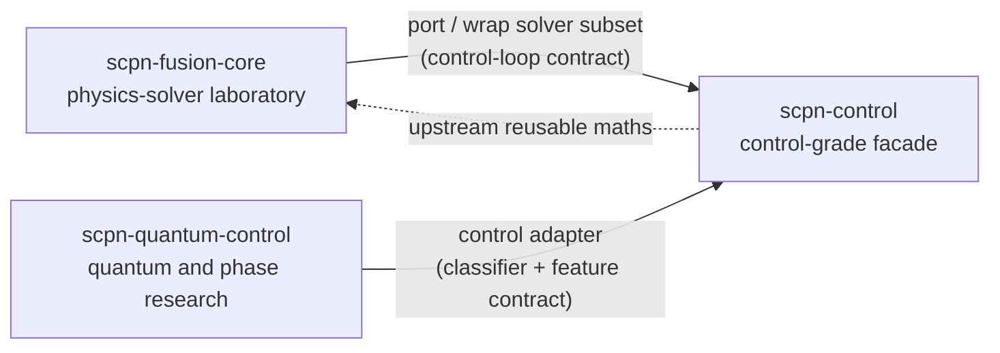
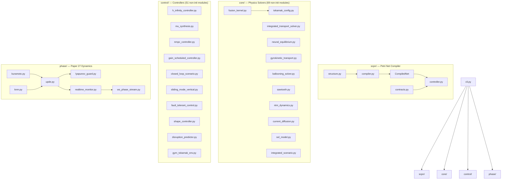
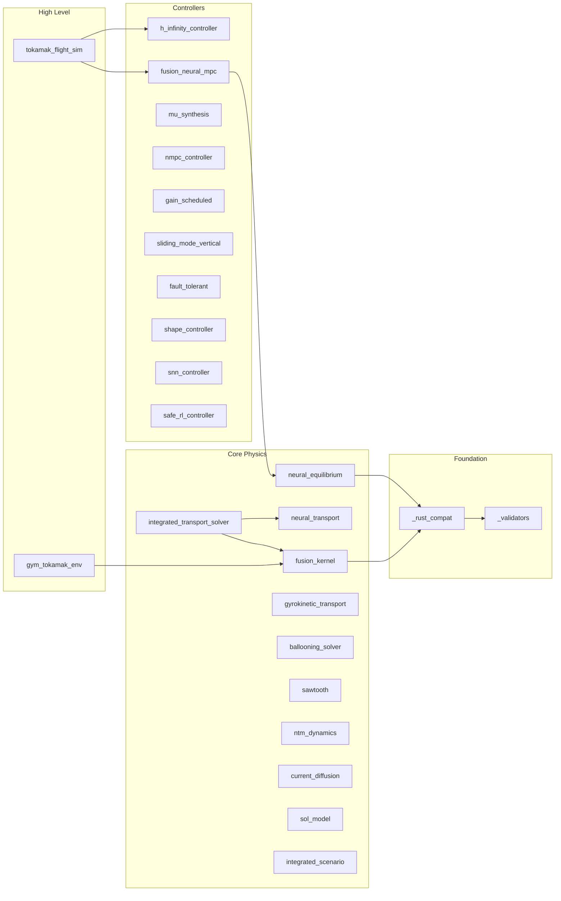
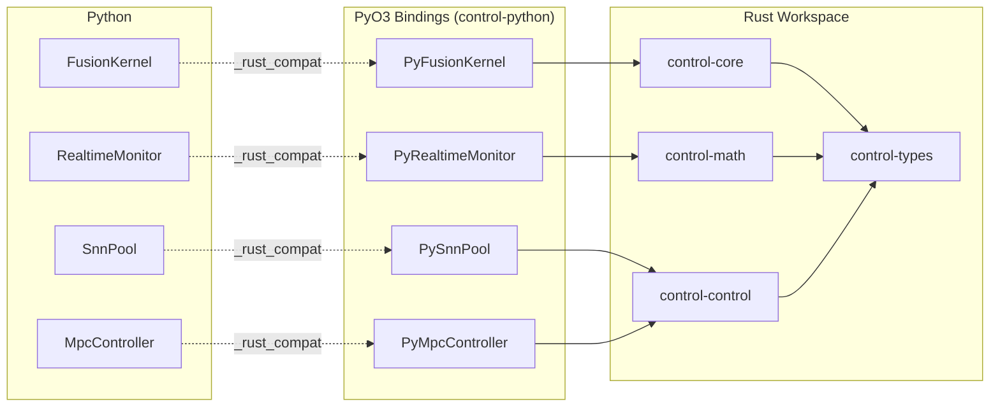
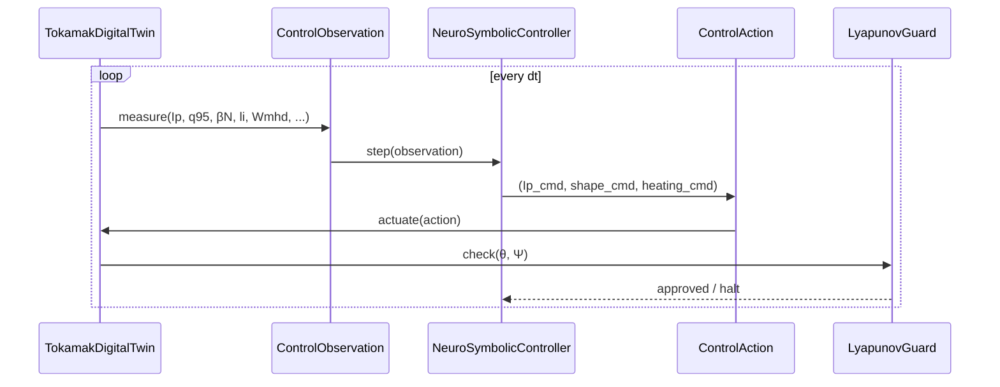

<!-- SPDX-License-Identifier: AGPL-3.0-or-later | Commercial license available -->
<!-- © Concepts 1996–2026 Miroslav Šotek. All rights reserved. -->
<!-- © Code 2020–2026 Miroslav Šotek. All rights reserved. -->
<!-- ORCID: 0009-0009-3560-0851 -->
<!-- Contact: www.anulum.li | protoscience@anulum.li -->
<!-- Project: SCPN Control -->
<!-- Description: Architecture guide. -->

# Architecture

Architecture decisions are recorded as focused ADRs under
[Architecture Decision Records](adr/index.md). The ADR set captures the standing
decisions behind module ownership, cross-repository boundaries, Python/Rust/PyO3
dispatch, solver selection, validation strategy, and public versus internal API
surfaces.

## SCPN ecosystem and cross-repository contracts

`scpn-control` is one repository in a three-repository SCPN ecosystem. Each
repository owns a distinct surface, and the boundaries between them are explicit
contracts rather than copied code. Understanding the split explains why a given
capability lives where it does, and where to look for the canonical version of a
physics model, a quantum routine, or a control surface.

| Repository | Role | Owns |
|------------|------|------|
| [`scpn-fusion-core`](https://github.com/anulum/scpn-fusion-core) | Physics-solver laboratory | Broad physics kernels, high-fidelity numerical formulation, external-code validation campaigns, facility-data integration, Rust and GPU solver paths, 3D equilibrium / stellarator / VMEC / free-boundary internals, and neural physics training stacks. |
| [`scpn-control`](https://github.com/anulum/scpn-control) (this repository) | Control-grade integration and facade | Bounded public control APIs, NMPC and controller-loop integration, Petri-net and SNN runtime contracts, replay and campaign metadata, fail-closed adapters, HIL/CODAC/EPICS/WebSocket safety boundaries, control-side source and actuator gradients, and traceable claim surfaces. |
| [`scpn-quantum-control`](https://github.com/anulum/scpn-quantum-control) | Quantum and phase-dynamics research | Quantum disruption classifiers, Qiskit/PennyLane execution and provider integration, and quantum Kuramoto/UPDE variants. `scpn-control` consumes a bounded control adapter for the quantum disruption path rather than re-implementing it. |

### Why the split exists

Each surface has a **single canonical owner**, so the same work is not developed
twice and each repository's public claims stay scoped to what it can validate:

- A physics solver matures in `scpn-fusion-core` first; `scpn-control` ports or
  wraps the subset that has a clear control-loop contract, turning selected
  physics into auditable controller surfaces.
- The quantum path is owned in `scpn-quantum-control`; `scpn-control` holds only
  the control adapter, classifier API, and feature-ordering contract.
- When `scpn-control` needs new mathematics, the solver-level result belongs
  upstream in `scpn-fusion-core`, so that control stays a bounded facade and does
  not become a second physics laboratory with divergent copies of the same model.

### What crosses a boundary

Every cross-repository boundary is a contract, not a shared mutable file. When a
capability is ported between repositories, the boundary fixes:

- physical units, array shapes, and timestep semantics;
- the failure mode (boundaries fail closed when an optional dependency, native
  backend, or evidence gate is unavailable);
- replay metadata, provenance, and the bounded public-claim status of the result.


```mermaid
graph LR
    FC["scpn-fusion-core<br/>physics-solver laboratory"]
    QC["scpn-quantum-control<br/>quantum and phase research"]
    CC["scpn-control<br/>control-grade facade"]
    FC -- "port / wrap solver subset<br/>(control-loop contract)" --> CC
    QC -- "control adapter<br/>(classifier + feature contract)" --> CC
    CC -. "upstream reusable maths" .-> FC
```

The remainder of this page describes the internal architecture of `scpn-control`
itself. The relationship to `scpn-fusion-core` is also summarised in the project
[README](https://github.com/anulum/scpn-control#relationship-to-scpn-fusion-core).

## Module Map


```mermaid
graph TD
    CLI[cli.py] --> SCPN[scpn/]
    CLI --> CORE[core/]
    CLI --> CTRL[control/]
    CLI --> PHASE[phase/]

    subgraph "scpn/ — Petri Net Compiler"
        SPN[structure.py] --> COMP[compiler.py]
        COMP --> CNET[CompiledNet]
        CNET --> NSC[controller.py]
        CON[contracts.py] --> NSC
    end

    subgraph "core/ — Physics Solvers (69 non-init modules)"
        FK[fusion_kernel.py] --> TC[tokamak_config.py]
        ITS[integrated_transport_solver.py]
        NEQ[neural_equilibrium.py]
        GT2[gyrokinetic_transport.py]
        BS2[ballooning_solver.py]
        ST2[sawtooth.py]
        NTM2[ntm_dynamics.py]
        CD2[current_diffusion.py]
        SOL2[sol_model.py]
        ISS2[integrated_scenario.py]
    end

    subgraph "control/ — Controllers (51 non-init modules)"
        HINF2[h_infinity_controller.py]
        MU2[mu_synthesis.py]
        NMPC2[nmpc_controller.py]
        GS_C[gain_scheduled_controller.py]
        CLS[closed_loop_scenario.py]
        SM2[sliding_mode_vertical.py]
        FT2[fault_tolerant_control.py]
        SC2[shape_controller.py]
        DP[disruption_predictor.py]
        GYM[gym_tokamak_env.py]
    end

    subgraph "phase/ — Paper 27 Dynamics"
        KUR[kuramoto.py] --> UPDE[upde.py]
        KNM[knm.py] --> UPDE
        UPDE --> LG[lyapunov_guard.py]
        UPDE --> RM[realtime_monitor.py]
        RM --> WS[ws_phase_stream.py]
    end
```

## Logical Data Flow

The following diagram illustrates the signal path from equilibrium input to real-time
actuation through the optional Rust acceleration layer.

```text
GEQDSK/IMAS Input
    ↓
FusionKernel (GS solver, 65×65)
    ↓                    ↓
NeuralEquilibrium   IntegratedTransportSolver
(0.39ms surrogate)    (1.5D Crank-Nicolson)
    ↓                    ↓
    └──────┬─────────────┘
           ↓
    Controller Selection
    ├── PID / Gain-Scheduled (GainScheduledController)
    ├── H-infinity (HInfinityController)
    ├── Mu-Synthesis (MuSynthesisController)
    ├── NMPC (NMPCController, SQP 20-step)
    ├── MPC (ModelPredictiveController)
    ├── Sliding-Mode (SlidingModeVerticalController)
    ├── Fault-Tolerant (FaultTolerantController)
    ├── Shape (ShapeController)
    ├── RL/PPO (SafeRLController + SB3)
    └── SNN (LIF+NEF SNN Controller)
           ↓
    DisruptionPredictor
    (LSTM + Greenwald + VDE)
           ↓
    SPIMitigation → CoilSet actuation
           ↓
    Rust control cycle (~5 µs P50 CI, PyO3)
```

The diagram is a module map and claim-boundary guide, not a statement that every
listed controller is exercised in one runtime path. The currently wired bounded
closed-loop E2E demo path is:

```text
scpn-control demo --scenario combined
    ↓
control.closed_loop_scenario.run_integrated_scenario_closed_loop
    ↓
control.scenario_scheduler.FeedforwardController
    ↓
core.integrated_scenario.IntegratedScenarioSimulator
    ↓
core.integrated_scenario.audit_scenario_coupling
```

That path applies the scheduled-plus-feedback auxiliary-heating command before
each integrated-scenario plant step, records the bounded actuator command, and
emits a replay coupling audit. It is repository wiring evidence only; measured
discharge validation and target-hardware admission remain separate gates.

## Practical architecture framing

The stack is organized in layers so teams can replace one layer without
rebuilding the whole system:

- **Plant models (Core)** evolve state and produce physics-ready observables.
- **Controllers (Control)** convert those observables into actions under explicit
  constraints.
- **Phase dynamics (Phase)** manage timing and synchronization artifacts that are
  hard to model as low-order linear systems.
- **Execution boundary (Rust/Python)** defines where hard-time and safety-critical
  work must stay deterministic and where Python orchestration can remain
  high-level.

The practical guarantee this architecture targets is not “all code in Rust,” but a
controlled boundary: scientific experimentation stays ergonomic, while hot-path
execution uses bounded contracts and evidence-linked certificates. This is why
the project publishes both a pure-Python path and a fused native path: they share
the same contracts, but have different runtime envelopes and admissible claims.

## Module Dependencies

Simplified internal dependency graph (arrows indicate "imports"):


```mermaid
graph LR
    subgraph "High Level"
        FS[tokamak_flight_sim]
        GYM[gym_tokamak_env]
    end

    subgraph "Controllers"
        MPC[fusion_neural_mpc]
        HINF[h_infinity_controller]
        MU[mu_synthesis]
        NMPC[nmpc_controller]
        GS_CTRL[gain_scheduled]
        SM[sliding_mode_vertical]
        FT[fault_tolerant]
        SC[shape_controller]
        SNN[snn_controller]
        SRL[safe_rl_controller]
    end

    subgraph "Core Physics"
        ITS[integrated_transport_solver]
        FK[fusion_kernel]
        NEQ[neural_equilibrium]
        NT[neural_transport]
        GT[gyrokinetic_transport]
        BS[ballooning_solver]
        ST[sawtooth]
        NTM[ntm_dynamics]
        CD[current_diffusion]
        SOL[sol_model]
        ISS[integrated_scenario]
    end

    subgraph "Foundation"
        RC[_rust_compat]
        VAL[_validators]
    end

    FS --> MPC
    FS --> HINF
    GYM --> FK
    MPC --> NEQ
    ITS --> FK
    ITS --> NT
    FK --> RC
    NEQ --> RC
    RC --> VAL
```

## Rust / Python Boundary


```mermaid
flowchart LR
    subgraph Python
        P1[FusionKernel]
        P2[RealtimeMonitor]
        P3[SnnPool]
        P4[MpcController]
    end

    subgraph "PyO3 Bindings (control-python)"
        B1[PyFusionKernel]
        B2[PyRealtimeMonitor]
        B3[PySnnPool]
        B4[PyMpcController]
    end

    subgraph "Rust Workspace"
        R1[control-core]
        R2[control-math]
        R3[control-control]
        R4[control-types]
    end

    P1 -. "_rust_compat" .-> B1 --> R1
    P2 -. "_rust_compat" .-> B2 --> R2
    P3 -. "_rust_compat" .-> B3 --> R3
    P4 -. "_rust_compat" .-> B4 --> R3
    R1 --> R4
    R2 --> R4
    R3 --> R4
```

The `_rust_compat.py` module probes for the compiled `scpn_control_rs` extension
at import time. If present, hot paths (GS solve, Kuramoto step, SNN tick, MPC
solve) dispatch to Rust. Otherwise, pure-NumPy fallbacks execute identically.

## Data Flow: Closed-Loop Control


```mermaid
sequenceDiagram
    participant Plant as TokamakDigitalTwin
    participant Obs as ControlObservation
    participant Ctrl as NeuroSymbolicController
    participant Act as ControlAction
    participant Guard as LyapunovGuard

    loop every dt
        Plant->>Obs: measure(Ip, q95, βN, li, Wmhd, ...)
        Obs->>Ctrl: step(observation)
        Ctrl->>Act: (Ip_cmd, shape_cmd, heating_cmd)
        Act->>Plant: actuate(action)
        Plant->>Guard: check(θ, Ψ)
        Guard-->>Ctrl: approved / halt
    end
```

## Directory Layout

```
scpn-control/
├── src/scpn_control/     # 154 Python modules (149 non-init)
│   ├── scpn/             # SPN → SNN compiler (8 non-init modules)
│   ├── core/             # Equilibrium, transport, scaling (69 non-init modules)
│   ├── control/          # Controllers (51 modules, optional deps guarded)
│   └── phase/            # Kuramoto/UPDE engine (9 modules)
├── scpn-control-rs/      # Rust workspace (5 crates)
├── tests/                # Module-specific tests with a 99% coverage gate


├── examples/             # 6 notebooks + 3 scripts
├── validation/           # DIII-D, JET, SPARC, ITER configs + reference data
├── docs/                 # MkDocs site
└── tools/                # CI gates, calibration, publishing
```

## How to read this architecture page

The architecture page is for tracing where data and control move, and where timing guarantees are expected to hold.

In practice:

- Treat `control/` and `core/` as semantic surfaces that describe behavior.
- Treat `scpn-control-rs` as the execution boundary for hot-path timing constraints.
- Treat `cli.py` and orchestration scripts as control-plane selectors, not as the timing-critical loop itself.

Use this map to isolate review risk: logic updates belong to module-level testing; timing regressions belong to native-path benchmarks and deployment constraints.

## Enterprise onboarding to this architecture

This map is intended to reduce review uncertainty in three steps:

1. **Traceability first**: map each change to a module family (`scpn`, `core`,
   `control`, or `phase`) before touching timing paths.
2. **Execution boundary check**: choose whether code is expected to run in
   Python orchestration or Rust/PyO3 hot path.
3. **Claim boundary check**: only promote the relevant result channel (`local_regression`,
   `reference_validated`, `external_code_validated`, etc.) when the claim level
   explicitly allows it.

The same graph is therefore used for two different operations:

- **Research mode**: maximize iteration speed with clear module-level acceptance.
- **Deployment readiness mode**: pin execution boundaries, capture host metadata, and
  route claims through the strict validators.

This gives the project a practical control plane for both speed and governance.

## Practical use and scope

Use this document to identify the module boundaries before making engineering changes across control, physics, transport, and verification surfaces.

- Start here when deciding whether to modify Rust/PyO3, Python orchestration, or deployment-admission code.
- Use it as the first checkpoint before changing subsystem APIs or control-loop contracts.
- Cross-check release claims against this map and `docs/capability_manifest.md` before updating public narratives.
